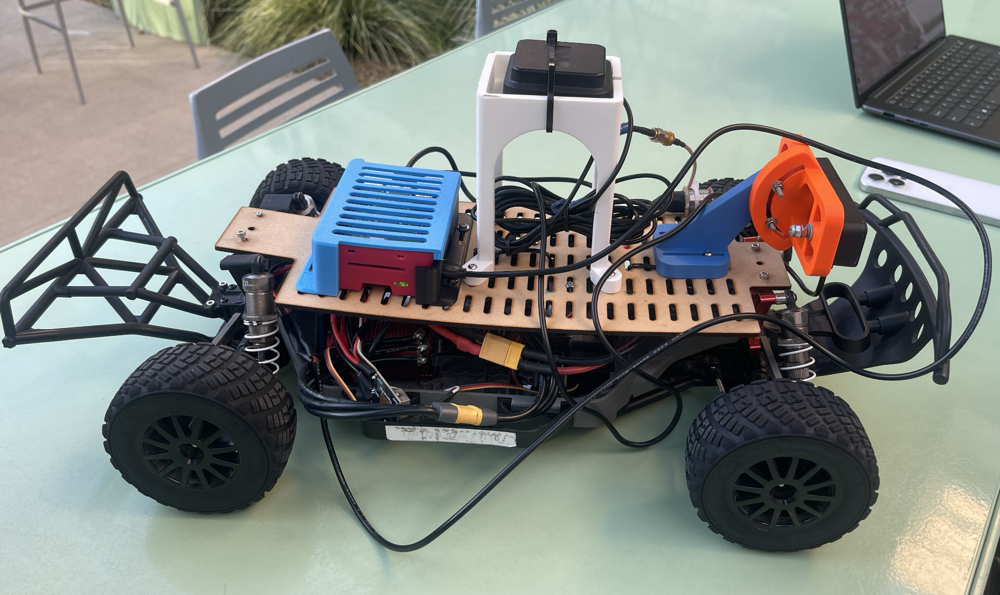

<h1 align="center">DonkeyCar Deep Learning AI Hat Acceleration</h1>

  

<h3 align="center">ECE MAE 148 Final Project</h3>
<h4 align="center">Team 6 Winter 2026</h4>
  

## Table of Contents
  <ol>
    <li><a href="#team-members">Team Members</a></li>
    <li><a href="#abstract">Abstract</a></li>
    <li><a href="#promises-and-bonus-goals">Promises and Bonus Goals</a></li>
    <li><a href="#final-metrics">Final Metrics</a></li>
    <li><a href="#accomplishments">Accomplishments</a></li>
    <li><a href="#challenges">Challenges</a></li>
    <li><a href="#documentation">Documentation</a></li>
    <li><a href="#potential-improvements">Potential Improvements</a></li>
    <li><a href="#acknowledgements">Acknowledgements</a></li>
</ol>

## Team Members
Bryan Lu (ECE) - bklu@ucsd.edu

David Shimizu (MAE) - dkshimizu@ucsd.edu

Eric Wang (CSE) - ejw001@ucsd.edu

Ulises Urrutia (MAE) - uurrutia@ucsd.edu

## Abstract
Our project aimed to implement the Hailo AiHat+ with the Raspberry Pi 5 as a neural network accelerator, speeding up a variety of tasks including deep learning, image recognition, and machine learning.

## Promises and Bonus Goals

### Promised
- Benchmarked performance for:
  - **RPI w/ Tensorflow/HailoRT**  
       
    

- Documentation for the Process

### Bonus Goals
* Benchmarked performance for models with different resolutions
* Full integration and usage with a deep learning problem, such as object avoidance

## Final Metrics

  

## Accomplishments
- Load and integrate Hailo Executable Files (.hef) into DonkeyCar
- Optimize .hef inference pipeline from ~300 FPS to ~2100 FPS
- Benchmarked performance for 160x120 resolution model
- Car drives autonomously with the .hef model on the AI HAT+
- Created step-by-step documentation for AI HAT+ setup, model conversions, benchmarking, and autonomous driving

## Challenges
- Understanding what we needed to do and what was previously implemented was our main hurdle. Since the codebase is relatively large, understanding what code we needed to change required a lot of time.
- From our research, there has been no changes or additions to the compiler that is needed to convert our files to .hef, so we still needed to use and optimize the scripts implemented by previous year's.
- Power was a weird issue since the AI Hat+ with the RPI5 required a 5A DC/DC converter, which we were able to get later on
- Without GPU access in a previously set-up docker container, TensorRT conversion could not be completed.
- Similar to last year's group, we had issues with the VESC operating at low speeds.

## Documentation
- [Hailo AI Hat+ Setup and Model Conversion Guide](https://docs.google.com/document/d/1MRzc6OT8vrefWFaT8_mfcn75FXvgug4Jw4WXdJh5Gkc/edit?usp=sharing)
- [Documentation from previous team](https://docs.google.com/document/d/1QD8mm4k70a3tMuctATGWsUEb5U5Y7lgBpjXv3FvxDJg/edit?usp=sharing)
- [RP5 cover mechanical drawing](https://github.com/j5995/148-winter-2026-final-project-team-6/blob/1d88f50f7b7d497eb59dd93447493ef3c77e744b/RP5cover/PI5shell.pdf) [STL](https://github.com/j5995/148-winter-2026-final-project-team-6/blob/1d88f50f7b7d497eb59dd93447493ef3c77e744b/RP5cover/PI5shell.stl) [Fusion.f3d](https://github.com/j5995/148-winter-2026-final-project-team-6/blob/1d88f50f7b7d497eb59dd93447493ef3c77e744b/RP5cover/PI5shell.f3d)
  

## Potential Improvements
- Test Models at Different Resolutions and Functions
  - Test and optimize models based on OAKD lite resolution to find the highest-performing resolutions for deep learning.
  - Test and optimize models based on deep learning objectives to test real-world applications for future projects.
- Tweak throttle and steering values
  - We manually scaled down the throttle and steering to stop it from being too high, but the issue most likely lies within the conversion
- Integration with OAKD camera
  - Since the camera has it's own computer vision functions, we can use it to handle feature abstraction and the AI Hat+ to handle inferences, with the RPI5 as the center module that makes decisions

## Acknowledgements
Documentation and Project referenced and continued heavily from [Team 4 - Winter 2025](https://github.com/UCSD-ECEMAE-148/148-winter-2025-final-project-team-4)
